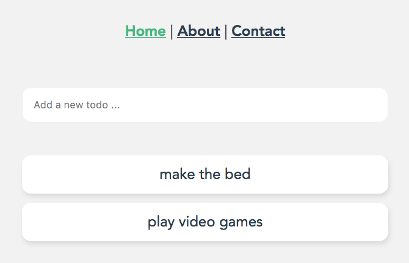
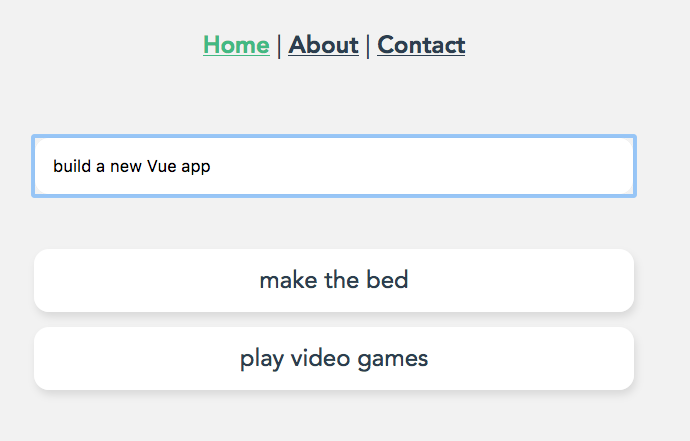
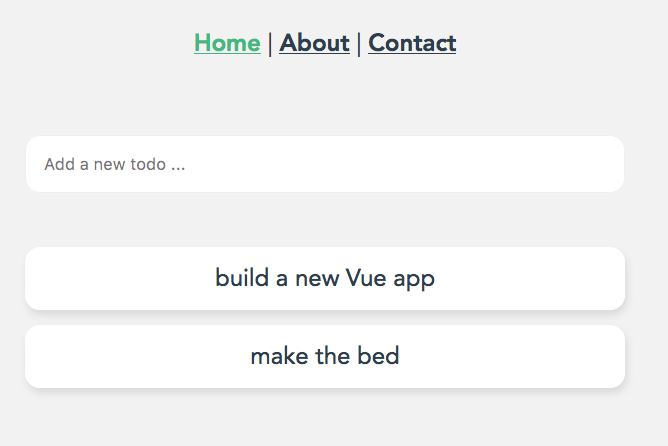
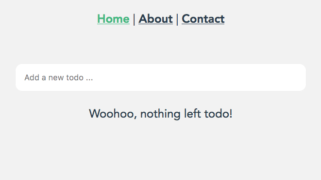
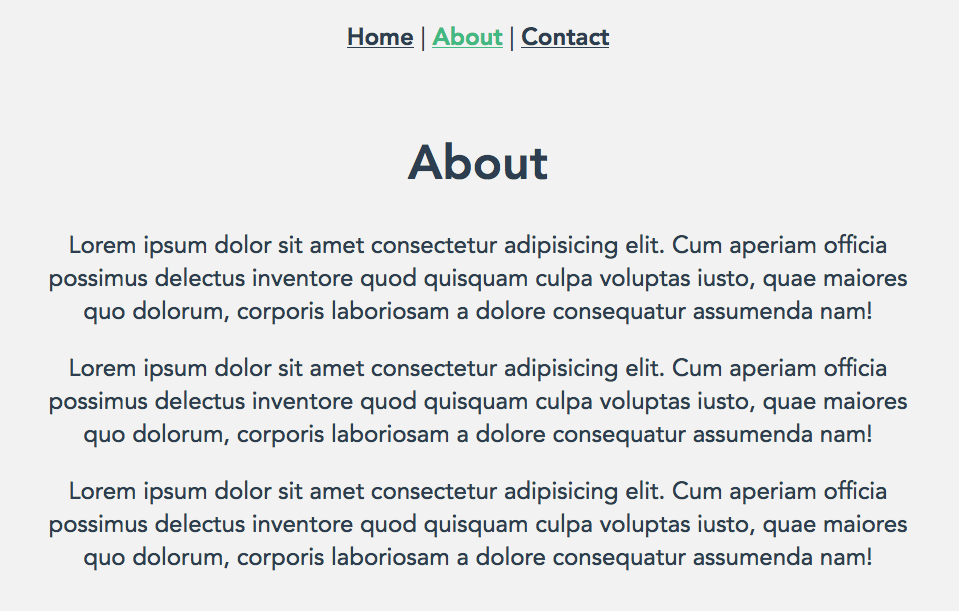
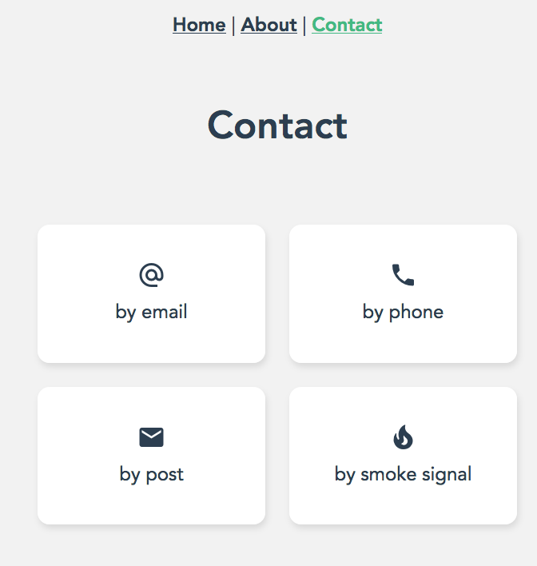

# Vue Todo
This project is based on [Shaun Pelling tutorial on Vue Animations](https://www.youtube.com/watch?v=RIApQjn9fvw&list=PL4cUxeGkcC9ghm7-iTfS9n468Kp7l9Ipu).

Please note that the master branch does not implement the animations, although Shaun's tutorial is all about Vue transitions. This repository has another branch dedicated to implementing transitions.

## Project Overview

### Main Screen

This app is a TODO app. It enables adding and removing TODOS from a list. The top of the main screen shows three links:

* _Home_ that is the main page;
* _About_ that is a simple page with textual info;
* _Contact_ that has some icons use to demonstate animations in the original project used by Shaun in his tutorial.

### Adding New TODO

### Removing Existing TODO

### About Page

### Contact Page

