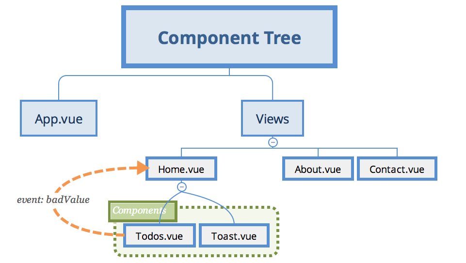

# Vue Todo
This project is based on [Shaun Pelling tutorial on Vue Animations](https://www.youtube.com/watch?v=RIApQjn9fvw&list=PL4cUxeGkcC9ghm7-iTfS9n468Kp7l9Ipu).

Please note that the master branch does not implement the animations, although Shaun's tutorial is all about Vue transitions. This repository has another branch dedicated to implementing transitions.

## Project Overview

### Main Screen

This app is a TODO app. It enables adding and removing TODOS from a list. The top of the main screen shows three links. At the center of the page, there is the data input, where the user writes down their TODO. The bottom of the screen shows the TODO list. Newest TODOS are listed first.

### Adding New TODO

Adding a new TODO is as simple as typing the TODO in the input text and hitting `Enter`.

This will update the original TODO list by adding the new TODO on top of the stack.

### Removing Existing TODO

One can remove a TODO from the list by clicking on the TODO. 

When all TODOS are removed, the message _Woohoo, nothing left todo!_ is shown.

### About Page

This is a simple page with textual info. It is used in Shaun's tutorial to showcase transitions between pages.

### Contact Page

This is also a simple page. The icons are strategically used for demonstating animations in the original project - used by Shaun in his tutorial.

## Views and Components Overview

Apart from the `Home.vue`, the other two _Views_ consists of pure text. The `Home.vue` groups two components: `Todos.vue` that is responsible for managing all TODO operations, and `Toast.vue` that is a mensage used when the user hits `Enter` in a blank input box.

## Dependencies

The original project has no additional dependency other than the Vue Router.